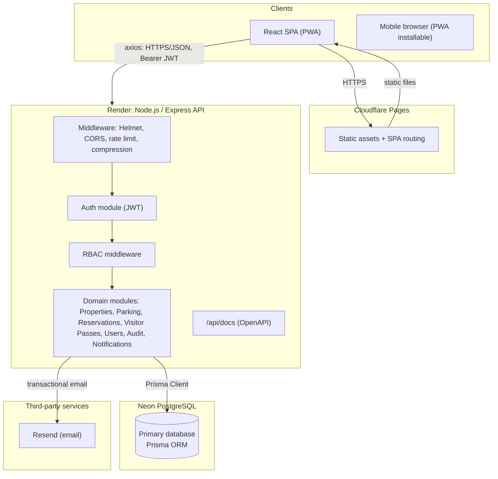
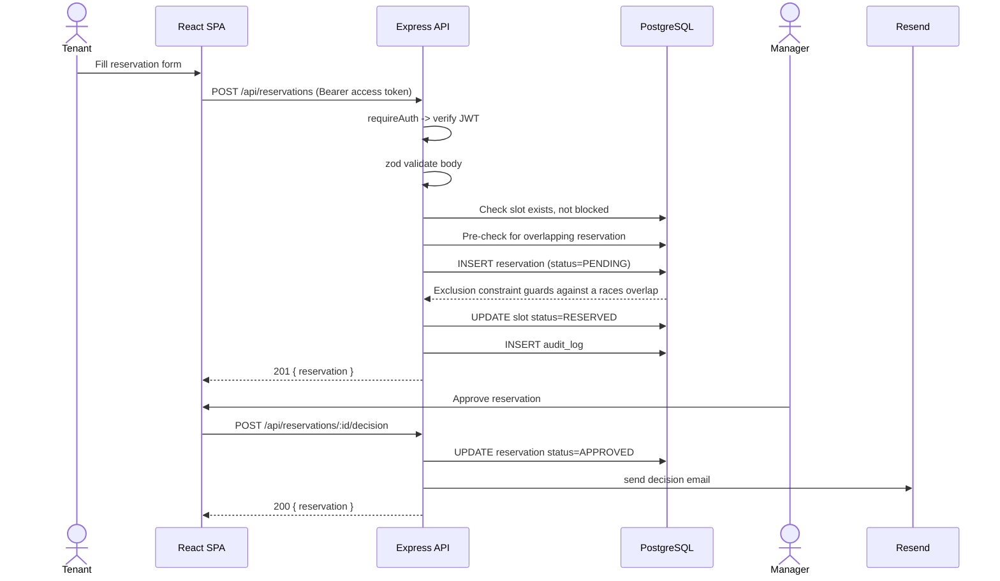
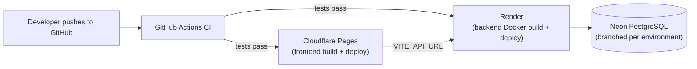

# Architecture

## High-level architecture



## Request flow (a typical reservation)



## Component architecture (backend)

The backend is a modular monolith: each business capability is a self-contained module
(`schemas.ts` for zod validation, `service.ts` for business logic + Prisma calls, `routes.ts`
for Express wiring + Swagger annotations). This keeps the system simple to run and deploy
today, while the module boundaries are where a future split into microservices would occur
(see "Scalability" below) — a module's `service.ts` never imports another module's `service.ts`
directly except through its exported functions, so each module could become its own service
behind the same HTTP contract without a rewrite.

```
Request -> middleware (helmet/cors/rateLimit) -> route -> requireAuth -> requireRole
         -> validate(zod) -> controller (in routes.ts) -> service -> Prisma -> PostgreSQL
                                                        \-> recordAudit (fire-and-forget)
                                                        \-> sendEmail (where relevant)
         <- errorHandler (catches AppError / ZodError / Prisma errors) <-
```

## Component architecture (frontend)

```
main.tsx -> App.tsx (QueryClientProvider, AuthProvider, RouterProvider)
         -> router.tsx (route table: public auth pages, ProtectedRoute -> AppShell -> RoleGuard -> feature pages)
Feature folder pattern: features/<domain>/{<domain>.hooks.ts (react-query), <domain>.schemas.ts (zod), *Page.tsx}
Shared: components/ui (shadcn-style primitives), components/layout (Sidebar/Topbar/AppShell),
        context/AuthContext (session state), lib/apiClient (axios + refresh interceptor)
```

## Authentication flow

```mermaid
sequenceDiagram
    participant SPA
    participant API

    SPA->>API: POST /auth/login {email, password}
    API-->>SPA: { user, accessToken (15m), refreshToken (30d, opaque) }
    Note over SPA: Tokens stored client-side; access token sent as Bearer header

    SPA->>API: GET /api/* (Authorization: Bearer <access>)
    API-->>SPA: 200 (if valid) or 401 (expired/invalid)

    alt Access token expired
        SPA->>API: POST /auth/refresh { refreshToken }
        API->>API: Look up hash(refreshToken), check not revoked/expired
        API->>API: Revoke old token, issue new pair (rotation)
        API-->>SPA: { user, accessToken, refreshToken }
        SPA->>API: Retry original request with new access token
    end
```

Refresh tokens are **opaque random strings**, not JWTs: the server stores only a SHA-256 hash
of each one, so a stolen database dump can't be used to mint sessions, and any individual
session (or all of a user's sessions) can be revoked instantly without a JWT blacklist.

## Authorization flow (RBAC)

Every protected route declares `requireAuth` (verifies the JWT, attaches `req.user = {id, role}`)
and, where needed, `requireRole(...roles)`. Row-level checks (e.g. "is this user a manager of
*this specific* property") are done inside the service layer (`userCanManageProperty`) because
they depend on data, not just role.

| Role | Typical permissions |
|---|---|
| SUPER_ADMIN | Everything, including deleting users |
| PROPERTY_OWNER | Manage own property's inventory/rates, approve reservations, view revenue |
| PROPERTY_MANAGER | Manage assigned property, its users, parking inventory, reservations, and visitor passes |
| PARKING_ATTENDANT | Check-in/check-out, validate visitor passes, block/unblock bays |
| TENANT | Request reservations, register vehicles, issue visitor passes |
| VISITOR | Hold a visitor pass; no login required to be parked, but can self-register to track their own bookings |

## Deployment architecture



- **Frontend**: Cloudflare Pages builds `frontend/` on every push to `main` (via GitHub integration
  or the `wrangler pages deploy` CLI); `public/_redirects` handles SPA routing.
- **Backend**: Render builds the Dockerfile in `backend/` per `render.yaml`; health checks hit `/health`.
- **Database**: Neon Postgres, one branch per environment (`main` for prod, a branch per PR for
  preview environments is a natural fit with Neon's branching model).
- **Email**: Resend, triggered directly from the API (not queued in this MVP — see roadmap for
  a background job queue once volume grows).

## Scalability notes

- The backend is **stateless**: no in-memory session storage, so it horizontally scales by
  adding Render instances behind its load balancer with no code changes.
- Prisma's connection pool is tuned per-instance; at higher scale, add PgBouncer (Neon supports
  this natively) in front of Postgres.
- The module boundaries described above are intentionally microservice-ready: `reservations`
  could be extracted first (it's the highest-traffic, most contended module) since it only
  talks to `properties`/`parking` through their service functions, not their tables directly... 
  in practice today they do share one Postgres schema for simplicity; splitting the database
  would be the next step after splitting the service.
