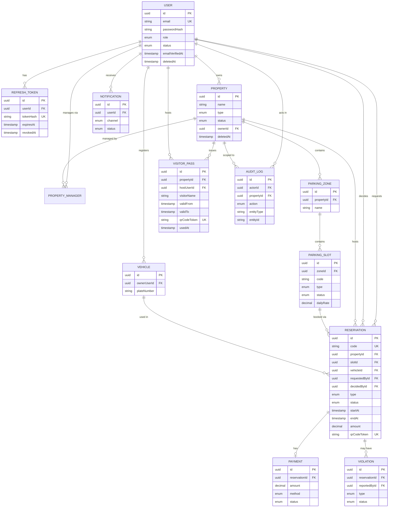

# Database Design & ERD

PostgreSQL via Prisma ORM. Full source of truth: `backend/prisma/schema.prisma`.

## Conventions

- **Primary keys**: UUID (`@default(uuid())`) everywhere except `reservations.id`... actually
  all tables use UUID; `AuditLog`/`RefreshToken` too. This avoids leaking sequential IDs and
  simplifies multi-environment data merges (e.g. Neon branch -> branch).
- **Audit fields**: `createdAt`, `updatedAt` on every table; `createdBy`/`updatedBy` (user id,
  not a FK, to tolerate the actor being deleted later) on the core mutable entities.
- **Soft delete**: `deletedAt DateTime?` on `User`, `Property`, `ParkingZone`, `ParkingSlot`,
  `Vehicle`, `Reservation`, `VisitorPass`. Every service query filters `deletedAt: null`; nothing
  is ever hard-deleted except via an explicit admin action, and `AuditLog` rows are never deleted.
- **Enums over free text** for every status/type field, enforced at the database level.

## Entity Relationship Diagram



## The one constraint that matters most: no double-booking

Prisma's schema DSL cannot express a PostgreSQL **exclusion constraint**, so it's applied as a
one-off SQL script after the initial migration (`backend/prisma/sql/add-reservation-overlap-constraint.sql`):

```sql
CREATE EXTENSION IF NOT EXISTS btree_gist;

ALTER TABLE reservations
  ADD COLUMN stay tstzrange GENERATED ALWAYS AS (tstzrange("startAt", "endAt", '[)')) STORED;

ALTER TABLE reservations
  ADD CONSTRAINT reservations_no_overlap
  EXCLUDE USING gist ("slotId" WITH =, stay WITH &&)
  WHERE (status NOT IN ('REJECTED', 'CANCELLED', 'EXPIRED', 'NO_SHOW'));
```

The application (`reservations.service.ts`) also checks for an overlap *before* inserting, purely
for a fast, specific error message. The constraint above is what actually prevents two
simultaneous requests from double-booking the same bay — a check-then-insert in application code
alone cannot guarantee that under concurrency.

## Indexing strategy

- Every foreign key used in a `WHERE` clause has a matching index (see `@@index` in the schema):
  `properties(status)`, `properties(type)`, `parking_slots(status)`, `parking_slots(type)`,
  `reservations(propertyId, status)`, `reservations(startAt, endAt)`, `audit_logs(entityType, entityId)`,
  `audit_logs(createdAt)`.
- The exclusion constraint's GiST index doubles as the lookup path for "is this bay free right now."

## Migrations & seeding

```bash
npx prisma migrate dev --name init        # creates tables from schema.prisma
psql "$DATABASE_URL" -f prisma/sql/add-reservation-overlap-constraint.sql
npm run seed                              # demo users (one per role) + one property + 12 bays
```

Seeded accounts (password `Passw0rd!` for all): `super.admin@`, `admin@`, `owner@`, `manager@`,
`attendant@`, `tenant@`, `visitor@parkflow.app`.


## Migrations & database changes

Step 1: First, make your desired changes (adding models, columns, indexes, or relations) inside prisma/schema.prisma:
Step 2: Run the Migration Command for local databse
```bash
npx prisma migrate dev --name <change_desc>
```
Step 2: Run the Migration Command to target (docker hosted) database. Need to modify the port in .env to point to docker hosted port
```bash
npx prisma migrate deploy
```